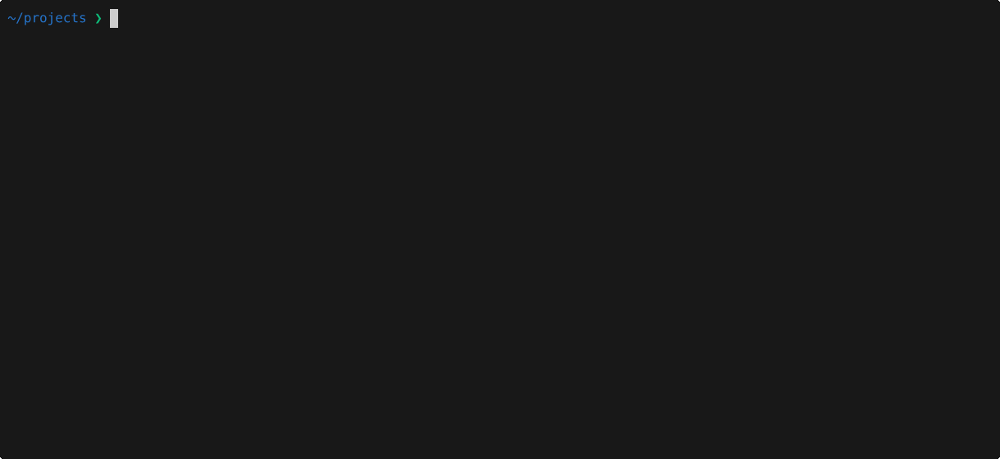
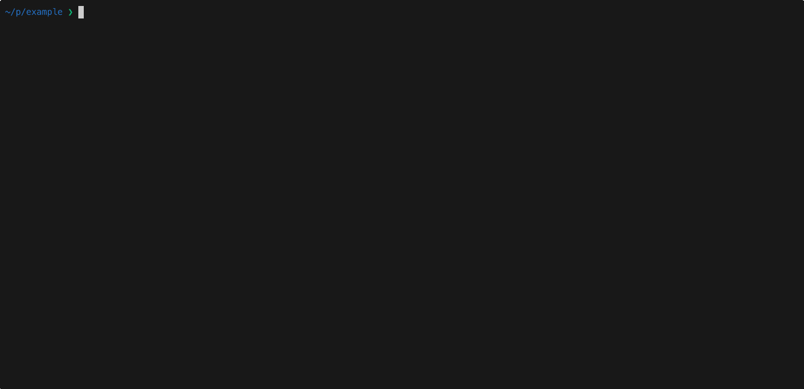

# totopo


A simple CLI to spin up a sandboxed environment for AI coding agents.


## Why totopo?

Here's the thing about AI agents: they're probabilistic. They occasionally misinterpret instructions, take unexpected shortcuts, or simply get it wrong. Most of the time they're fine. But "most of the time" isn't a great argument for giving them unrestricted access to your machine, your credentials, and your remote repositories.

totopo draws a simple boundary: agents get a full, capable environment to work in — they just can't touch anything outside the project, and they can't reach your remote. That's it. No domain whitelisting, no paranoia, no compromise on what the agent can actually do.
Reasonable containment for non-deterministic tools. Nothing more, nothing less.

Note: no sandbox substitutes for good judgment. Consider keeping any sensitive secrets or privileged scripts away from your agents.

## Requirements

- [Docker](https://www.docker.com/products/docker-desktop/) - used to build and run the sandboxed environment
- [git](https://git-scm.com/) - safeguard to ensure agents only run in projects with version control in place

## Quick Start

```bash
cd your-project
npx totopo
```

First-time setup — running `npx totopo` in a fresh repo, selecting a runtime mode, and waiting for the Docker image to build for the first time:


Opening a session when totopo is already initialized is quick. The agent is aware of the sandbox environment:


## Core features at a glance

- **Sandboxed Docker container** — your code runs in an isolated environment with strict filesystem and privilege boundaries
- **Agents can't reach remote** — push, pull, fetch, and clone are blocked inside the container, preventing agents from accidentally affecting your remote repositories
- **AI CLIs with persistent sessions** — OpenCode, Claude Code and Codex pre-installed, with conversation history that survives restarts and rebuilds
- **Host-mirror or generic runtime** — use a standard dev container, or let totopo match the container environment to your host so the agent works in the exact same setup as your codebase
- **Agents are sandbox aware** — agents are informed of their sandbox constraints at session start, so they can factor that into how they work.
- **Scoped mounts** — expose only the files and directories the agent needs

---

## Features in Detail

### Sandboxed dev container

Every session runs inside a Docker container. Your code is bind-mounted from the host — edits are immediately visible in your editor. The container enforces several isolation boundaries:

| Control | Implementation |
| --- | --- |
| Non-root user | All processes run as `devuser` (uid 1001) — cannot modify system-level config |
| Filesystem isolation | Only the repo is mounted — host filesystem is not visible |
| Git remote block | `protocol.allow = never` in `/etc/gitconfig` — push, pull, fetch, and clone are all refused; requires root to override |
| No host credentials forwarded | Host git credentials are never copied into the container |
| Secrets never in image | API keys loaded at runtime from `~/.totopo/.env` — never baked into the image, never mounted into the container |
| No privilege escalation | `no-new-privileges:true` prevents any process from gaining elevated permissions |

Remote git operations are blocked inside the container. Push from your host terminal instead.

### Scoped sandboxing

Mount only the files and directories you need into the container rather than the full repository. Two scoped modes are available: `cwd` (current directory only) and `selective` (hand-pick individual files and folders).

In both scoped modes, `.git` is intentionally not mounted. Mounting `.git` would expose the full commit history of every repository file — including files outside the mounted paths — which defeats the point of scoped access. As a result, git is unavailable inside a scoped session and the agent operates without repository history. The agent is instructed to surface these limitations at session start.

Scoped sessions are well-suited for focused tasks where you want to give the agent a narrow, explicit view of your codebase.

Example showcasing agent awareness of scope limitations:


### AI CLIs with persistent sessions

The container comes with the major AI coding CLIs ready to use out of the box:

```bash
opencode    # OpenCode
claude      # Claude Code (Anthropic)
codex       # Codex (OpenAI)
```

Agent session data is scoped per project — each repository gets its own isolated history, so agents don't bleed context between projects. To clear memory, run `npx totopo` and navigate to Advanced > Clear agent memory. This stops the container if running and removes the .totopo/agents/ directory.

### Dev container runtime

Choose between two modes:

- **Host-mirror** — the container runtime matches your host Node.js version and selected tools, keeping the environment consistent with your local setup.
- **Generic** — a full dev container with the latest stable versions of all tools. Good default if you don't need version parity with your host.

Either way, basic dev tools and all three AI CLIs are always included.

## What gets created in your project

```
your-project/
└── .totopo/
    ├── Dockerfile        # container image definition
    ├── post-start.mjs    # security checks + readiness summary on every start
    ├── settings.json     # runtime mode + selected tools (committed with project)
    ├── README.md         # .totopo reference
    └── agents/           # agent session data — gitignored, created on first session start
        ├── claude/            # mounted as ~/.claude/
        ├── opencode/          # mounted as ~/.config/opencode/ + ~/.local/share/opencode/
        └── codex/             # mounted as ~/.codex/

~/.totopo/.env            # API keys — global, outside all repos, never mounted into container
```

Agent session history and conversation data are persisted in the `agents` directory across container rebuilds and restarts. This directory is gitignored so session data stays local to your machine.

## Limitations

**Audio / microphone** — the image includes `sox` (required by Claude Code for voice mode), but audio passthrough from the host depends on your OS. macOS, Linux, and Windows each require different device configuration. If you need voice mode, set up audio passthrough manually for your platform.

## Disclaimer

MIT licensed and fully open source. Fork it, adapt it, make it yours. Issues are welcome — no promises on response time. Use at your own risk.