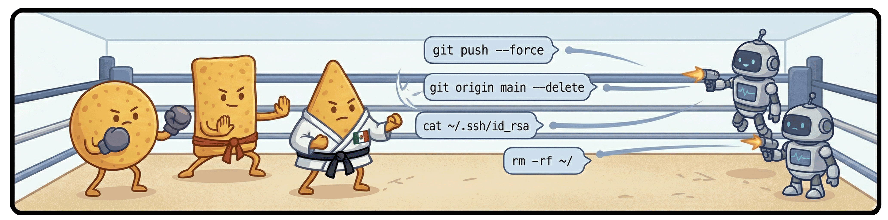

# totopo



Run AI coding agents in a secure local sandbox.


## Why totopo?

AI agents are non-deterministic. They occasionally get things wrong. Most of the time they're fine — but "most of the time" isn't a great argument for giving an agent unrestricted access to your machine, your credentials, and your remote repositories.

totopo draws a clear boundary: agents get a full, capable environment to work in — they just can't touch anything outside the workspace, and they can't reach your remote. No domain whitelisting, no paranoia, no compromise on what the agent can actually do.

## Requirements

- [Docker](https://www.docker.com/products/docker-desktop/) — builds and runs the dev container
- [Node.js](https://nodejs.org/) — required to run `npx totopo`

## Getting Started

```bash
cd your-project
npx totopo
```

`npx totopo` always runs the latest stable version — no install required. Alternatively, install globally to pin a specific version: `npm install -g totopo`.

> **Do not install totopo as a local project dependency.** totopo stores all workspace state in `~/.totopo/`, shared across all your workspaces. A local install means different projects could run different versions, which can break schema compatibility with shared config. Use `npx` or a global install.

## How totopo Works

totopo organises work around **workspaces** — any directory containing a `totopo.yaml` file. Running `npx totopo` for the first time in a directory walks you through a short setup and creates `totopo.yaml` (a small, well-documented config file that lives at the workspace root).

A few key concepts:

- **Workspace ID** - a unique slug declared in `totopo.yaml`. Used for container naming (`totopo-<id>`) and the local cache directory (`~/.totopo/workspaces/<id>/`).
- **Workspace Boundary** — `npx totopo` always resolves to the nearest `totopo.yaml` going up the directory tree. Each directory tree has exactly one workspace root.
- **Single Workspace Container** — totopo uses one Docker container per workspace, not one per session. Open as many terminals as you need — they all connect to the same running container, keeping resource use bounded and reconnections fast.

On every run, totopo shows the workspace menu:

- **Open session** — start or resume the dev container and connect
- **Stop container** — stop the running container
- **Manage Workspace** — profiles, shadow paths, rebuild, reset config
- **Manage totopo** — multi-workspace management (stop containers, clear memory, uninstall)

### Working directory

The workspace is always mounted at `/workspace` inside the container. When you run totopo from a subdirectory, you get a quick prompt to start **here** or at the **Workspace root**. If you're already at the workspace root, the session starts directly at `/workspace`.

## Core Features

### Container Isolation

Every session runs inside a Docker container. Your code is bind-mounted from the host — edits are immediately visible in your editor.

| Control | Implementation |
|---|---|
| Non-root user | All processes run as `devuser` (uid 1001) |
| No host credentials | Host git credentials are never copied into the container |
| No privilege escalation | `no-new-privileges:true` prevents any process from gaining elevated permissions |
| Filesystem isolation | Only the workspace directory is mounted; the rest of the host is not visible |
| Git remote block | `protocol.allow = never` in `/etc/gitconfig` — push, pull, fetch, and clone are refused |
| Shadow mounts | Selected paths overlaid with isolated container-local copies — see [Shadow Paths](#shadow-paths) |
| Environment vars | Injected from a host file at session start (`env_file`) |

Remote git operations are blocked inside the container. Run them from your host terminal.

### Profiles

Profiles let you define multiple container image variants for a workspace. Each profile defines a `dockerfile_hook` — raw Dockerfile instructions appended after the base image layers:

```yaml
# totopo.yaml
profiles:
  default:
    dockerfile_hook: |
      # Installs Go and Java.
      RUN apt-get update && apt-get install -y --no-install-recommends golang-go default-jdk-headless && rm -rf /var/lib/apt/lists/*
  slim:
    dockerfile_hook: |
      # No extras — uses the base image only (Node.js + git + AI CLIs).
  custom:
    dockerfile_hook: |
      # Add your own Dockerfile instructions below, or ask the agent inside the container to help.
      # e.g. Install Rust:
      #   RUN curl -sSf https://sh.rustup.rs | sh -s -- -y
  # Add more profiles here — or ask the agent inside the container to set one up for you.

```

Three profiles are set by default. When multiple profiles are defined, totopo prompts you to pick one at session start (the choice is remembered). Switch any time in **Manage Workspace > Profiles** — a profile change triggers a container rebuild.

The base image is defined in [`templates/Dockerfile`](templates/Dockerfile) — inspect it to see what's already included before adding your own layers. To force a fully fresh build (no Docker layer cache), use **Manage Workspace > Clean rebuild**.

### Shadow Paths

Shadow paths overlay specific files or directories with empty container-local equivalents. Changes stay in the container-local copy; your workspace files are hidden and untouched:

```yaml
# totopo.yaml
shadow_paths:
  - node_modules    # matches all nested node_modules directories
  - .env*           # hides .env, .env.local, etc. from agents
```

Patterns follow gitignore syntax — patterns without a `/` match at any depth. Manage via **Manage Workspace > Shadow paths** or edit `totopo.yaml` directly. Changes take effect on the next session.

Common use cases:
- **Separate `node_modules`** — the container installs its own dependencies, avoiding platform conflicts between host and container.
- **Hide sensitive files** — keep credentials and secrets invisible to agents.

### Environment Variables

You can point totopo at an env file relative to `totopo.yaml`:

```yaml
# totopo.yaml
env_file: .env
```

The file is loaded into the container's environment at session start. If the file is not found, totopo skips it with a warning.

### AI CLIs

The container comes with the major AI coding CLIs pre-installed and ready to use:

```bash
opencode    # OpenCode
claude      # Claude Code (Anthropic)
codex       # Codex (OpenAI)
```

Agents are self-aware — sandbox constraints, git remote block, and any active shadow path overlays are injected into agent context at every session start.

totopo updates all three CLIs to their latest published versions whenever a new session starts (container started or resumed).

### Persistent Agent Memory

Agent session data (conversation history, settings) is stored per workspace and survives container restarts and rebuilds.

```
~/.totopo/workspaces/<id>/agents/
├── claude/             # mounted as ~/.claude/ inside the container
│   └── .claude.json    # mounted as ~/.claude.json (persists Claude Code settings across rebuilds)
├── opencode/
│   ├── config/         # mounted as ~/.config/opencode/ inside the container
│   └── data/           # mounted as ~/.local/share/opencode/ inside the container
└── codex/              # mounted as ~/.codex/ inside the container
```

To clear memory: `npx totopo` → **Manage totopo > Clear agent memory**.

## What Gets Installed

`totopo.yaml` lives in your workspace directory — commit it alongside your code. Everything else lives in `~/.totopo/` on your machine; nothing else is written into your project.

```
~/.totopo/
└── workspaces/
    └── <workspace_id>/
        ├── .lock       # workspace root path + active profile
        ├── agents/     # agent session data (persists across rebuilds)
        │   ├── claude/
        │   │   └── .claude.json
        │   ├── opencode/
        │   │   ├── config/
        │   │   └── data/
        │   └── codex/
        └── shadows/    # container-local shadow path storage
```

## Troubleshooting

**Move or rename the workspace directory** — re-run `npx totopo` in the new location. totopo detects the path mismatch and guides you through realigning the workspace cache.

**Single machine** — `~/.totopo/` is local. Switching machines requires re-running setup in each workspace.

**Audio** — `sox` is included (required by Claude Code for voice mode), but audio passthrough depends on your OS. macOS, Linux, and Windows each require different device configuration.

**Shift+Enter not working in VS Code terminal** — add this to your VS Code keybindings (`Cmd+Shift+P` → "Open Keyboard Shortcuts (JSON)"):

```json
{
  "key": "shift+enter",
  "command": "workbench.action.terminal.sendSequence",
  "args": { "text": "\u001b[13;2u" },
  "when": "terminalFocus"
}
```

## Disclaimer

MIT licensed and fully open source. Issues welcome — no promises on response time. Use at your own risk.
