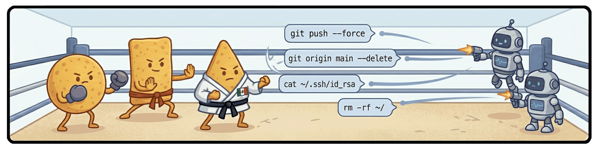
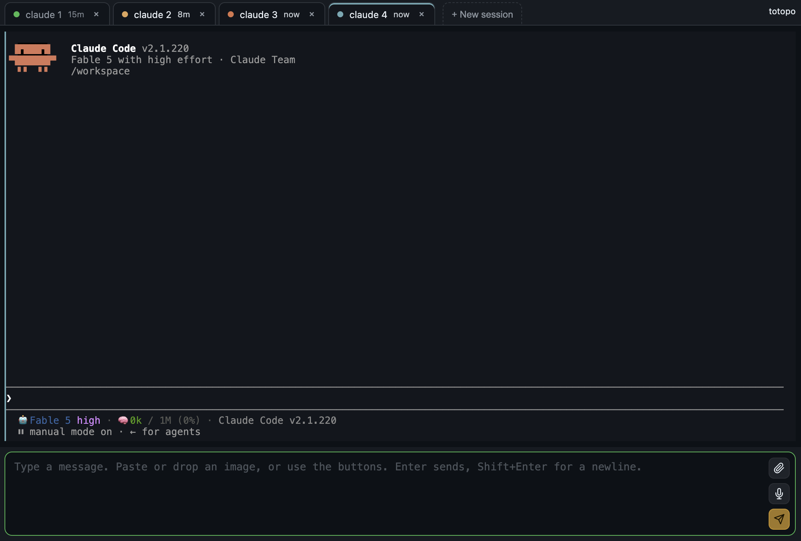

# totopo



Local sandbox for AI agents.


> [!IMPORTANT]
> This project was built with heavy Claude Code usage, so use it at your own risk.

## Quick Start

Basic flow - open a session, start an agent:


### Basic Usage

Run totopo from your project directory:

```bash
cd your-project
npx totopo
```

`npx totopo` always runs the latest stable version. Alternatively, install globally to pin a specific version: `npm install -g totopo`.

> **Do not install totopo as a local project dependency.** totopo stores all workspace state in `~/.totopo/`, shared across all your workspaces. A local install means different projects could run different versions, which can break schema compatibility with shared config. Use `npx` or a global install.

Once set up, the flow is simple:

1. Run `npx totopo` → **Open session**
2. Run `claude`, `opencode`, or `codex` - pick an agent, start working

A few things happen automatically:

- **Agents stay up to date** - totopo keeps all AI CLIs on their latest versions, checking for updates automatically.
- **Sessions are persistent** - agent memory and settings survive container restarts and rebuilds.
- **Agents stay inside the workspace** - they can't push to your remote or read anything outside it, and you can hide files like `.env` from them (see [Shadow Paths](#shadow-paths)). For the full picture, see [what totopo protects against](#what-totopo-protects-against).

For a deeper look at how totopo works and how to configure it, see the sections below.

### Advanced Session

A session with more features turned on: [AI CLIs get updated](#ai-clis), `claude` launches via [auto-start](#auto-start-agent), and exiting shuts everything down:


## Web agent interface

An opt-in browser front-end for the agents in the container.
It relays the real agent TUI - your subscription, no API key, same sandbox - and adds what a terminal cannot: every session on one page, images, and dictation.
Turn it on under **Settings → Web interface** (off by default), then run `webterm claude` (or `opencode` / `codex`) in the container to start it and print its URL - the agent you name is the one new sessions start with, and the browser can pick another per session.
With [auto-start](#auto-start-agent) on it comes up by itself and the greeting shows the URL.



- **Every session in one page.** The tab bar lists every session running in the container, up to 8. Click to switch, `+ New session` to start one, double-click to rename, drag to reorder.
- **Several agents at once.** One server runs claude, opencode and codex - one agent per session - so the bar can hold a `claude 1` tab next to a `codex 2` tab, each in its own directory. `+ New session` starts the usual one; the chevron beside it opens a small panel that asks which agent and which directory. `webterm <agent>` in the container moves which one is usual, without ending anything.
- **Sessions start where you did.** Run `npx totopo` inside `apps/api` and the browser's agent works on `apps/api`, the same directory a terminal session lands in. The chevron beside `+ New session` opens one somewhere else, and each session keeps its own for life.
- **Sessions outlive the browser.** They belong to the container, so a closed tab, dropped wifi or a slept laptop ends nothing, and opening the URL anywhere shows them all. One window drives a session at a time; another can take it over.
- **Tabs show what each agent is doing.** A light runs round a tab while its agent works, and the tab stays lit when one finishes, until you go and look. The browser tab shows the same from behind another window: the title counts the sessions waiting, and the icon carries a white bar sweeping along its bottom edge while an agent works and a green dot in its corner while one waits.
- **A chime when an agent finishes something you were not there for.** Ten seconds after a session finishes, if nobody has touched it since - no key, no click, no scroll - it sounds once. Touching it in those ten seconds is what calls the sound off, so the sessions you are actually working in stay quiet. The bell in the tab bar mutes it, and the choice is remembered.
- **Images and dictation.** Paste, drop or upload an image and the agent gets its path; dictate instead of typing.
- **Drafts stay with their session.** A half-written message, attachments included, waits until you send it or the session ends.
- **Stop the container from the page.** The power button at the right of the tab bar stops it - every session in it, browser and terminal alike - after a prompt that names what ends.
- **Its own sticky host port.** One loopback-only port per workspace from a range (default `3900-3999`), kept host-side and never in `totopo.yaml`, so the port survives restarts and rebuilds. Container port `3899` is reserved for the relay.
- **A key in the URL.** The printed URL ends in `/?k=<key>`, and the relay rejects anything without it - the page, the socket, uploads and the status probe alike. The key is created when the interface starts and never stored on the host, so it dies with the container. Reaching the port is not enough to drive your agent.
  If the key is no longer the live one, or the container is gone, the page says so instead of looking usable.
- **Same sandbox as the terminal.** Loopback-only, key-gated, origin-checked, non-root.
- **It never blocks a session.** If no port is free or the server does not come up, totopo says so and opens the session without it.

## Requirements

- [Docker](https://www.docker.com/products/docker-desktop/) - builds and runs the dev container
- [Node.js](https://nodejs.org/) - required to run `npx totopo`

## Who this is for

Developers who use `claude`, `codex`, or `opencode` **interactively** - one human pair-programming with one agent.

totopo isn't an orchestration tool (no SDK, no parallel agents, no per-run worktrees), and its security is basic - just the minimum precautions I think anyone running AI agents should take. If you need more on either front, look elsewhere.

### Motivation

Two fundamental risks when running AI agents locally:

1. Agents are unpredictable - they will make mistakes that may be hard to detect or undo.
2. Agents are vulnerable to prompt injection and can be subtly manipulated to leak sensitive data or execute unauthorized operations.

Totopo mitigates both risks by letting you run agents in a dev container - when you run totopo in a given directory, that directory is mounted as a workspace where agents can work freely, without access to the rest of your filesystem or your git remote.

In practice, this means any mistake can be reverted from your git remote, and even a compromised agent can't access sensitive files on your machine - SSH keys, credentials, browser data - things a locally-running agent could otherwise do without you ever noticing.

## How totopo Works

totopo organises work around **workspaces** - any directory containing a `totopo.yaml` file. Running `npx totopo` for the first time in a directory walks you through a short setup and creates `totopo.yaml` (a small, well-documented config file that lives at the workspace root).

A few key concepts:

- **Workspace ID** - a unique slug declared in `totopo.yaml`. Used for container naming (`totopo-<id>`) and the local cache directory (`~/.totopo/workspaces/<id>/`).
- **Workspace Boundary** - `npx totopo` always resolves to the nearest `totopo.yaml` going up the directory tree. Each directory tree has exactly one workspace root.
- **Single Workspace Container** - totopo uses one Docker container per workspace, not one per session. Open as many terminals as you need - they all connect to the same running container, keeping resource use bounded and reconnections fast.

### `totopo.yaml`

The config is minimal - only `workspace_id` is required; the rest are optional:

- **`workspace_id`** *(required)* - unique slug for container naming and cache directory
- **`shadow_paths`** *(optional)* - gitignore-style patterns hidden from agents (see [Shadow Paths](#shadow-paths))
- **`env`** *(optional)* - env files and/or inline `KEY=VALUE` variables injected at runtime (see [Environment Variables](#environment-variables))
- **`ports`** *(optional)* - publish container ports to the host, identity-mapped or `"HOST:CONTAINER"` (see [Published Ports](#published-ports))
- **`profiles`** *(optional)* - Dockerfile image variants (see [Profiles](#profiles))

The file totopo generates (onboarding, `Settings > Reset`) is deliberately minimal - just `workspace_id` and `shadow_paths`. Add the optional settings above as you need them; each is documented in this README.

On every run, totopo shows the workspace menu:

- **Open session** - start or resume the dev container and connect
- **Stop container** - stop the running container
- **Settings** - git mode, shadow paths, web interface, auto-start agent, rebuild container, clean rebuild, reset config
- **Advanced** - multi-workspace management (stop containers, clear memory, uninstall)

### Working directory

The workspace is always mounted at `/workspace` inside the container. The session opens wherever you ran totopo - from a subdirectory it starts at the matching path under `/workspace`, and from the workspace root it starts at `/workspace`. The whole workspace root stays mounted either way, so `cd /workspace` always reaches it.

## Core Features

### Container Isolation

Every session runs inside a Docker container. Your code is bind-mounted from the host - edits are immediately visible in your editor.

| Control | Implementation |
|---|---|
| Non-root user | All processes run as `devuser` (uid 1001) |
| No host credentials | Host git credentials are never copied into the container |
| No privilege escalation | `no-new-privileges:true` prevents any process from gaining elevated permissions |
| Filesystem isolation | Only the workspace directory is mounted; the rest of the host is not visible |
| Git guardrails | Per-workspace **git mode** controls what git can do inside the container - see [Git Modes](#git-modes) |
| Shadow mounts | Selected paths overlaid with isolated container-local copies - see [Shadow Paths](#shadow-paths) |
| Environment vars | Injected from host env files and/or inline `KEY=VALUE` at session start (`env`) |

### Git Modes

Each workspace has a git mode (set via **Settings > Git mode**) that controls what git operations are permitted inside the container:

| Mode | Local mutations | Remote (push/pull/fetch/clone) |
|---|---|---|
| **local** *(default)* | Allowed | Blocked at the gitconfig protocol layer |
| **strict** | Blocked - a read-only `git` wrapper allows inspection (`status`, `log`, `diff`, `blame`, `show`, etc.) and rejects mutations (`commit`, `add`, `reset`, `checkout`, etc.) | Blocked at the gitconfig protocol layer |
| **unrestricted** | Allowed | Allowed |

The active mode is recorded per workspace in `.lock`, exposed inside the container as `TOTOPO_GIT_MODE`, and reflected in the agent context so each session knows what is permitted. Switching modes recreates the container on the next session.

### Shadow Paths

Shadow paths overlay specific files or directories with empty container-local equivalents - they apply across all profiles. Changes stay in the container-local copy; your workspace files are hidden and untouched:

```yaml
# totopo.yaml
shadow_paths:
  - node_modules    # matches all nested node_modules directories
  - .env*           # hides .env, .env.local, etc. from agents
```

Patterns follow gitignore syntax - patterns without a `/` match at any depth. Manage via **Settings > Shadow paths** or edit `totopo.yaml` directly. Changes take effect on the next session.

Git-tracked paths are skipped to avoid worktree diversions. Shadowing them has no privacy benefit anyway since agents can `git show` tracked content. To hide a file, untrack it and add it to `.gitignore` first.

Common use cases:
- **Separate `node_modules`** - the container installs its own dependencies, avoiding platform conflicts between host and container.
- **Hide sensitive files** - keep credentials and secrets invisible to agents.

### Environment Variables

`env` injects environment into the container at session start.
It accepts a single value or a list, and each entry is one of two things:

```yaml
# totopo.yaml
env:
  - .env                  # an env-file path (no "="), loaded via --env-file
  - .env.local            # list order matters - later files win on a duplicate key
  - LOG_LEVEL=debug        # an inline "KEY=VALUE" variable (contains "=")
  - FEATURE_FLAG=1
```

A single env file can also be given as a scalar, without the list:

```yaml
# totopo.yaml
env: .env
```

- **Classification is by the presence of `=`.**
An entry with `=` is an inline variable; an entry without `=` is an env-file path resolved relative to `totopo.yaml`.
- **Inline variables win over file-provided values** on a duplicate key, so you can override a file's value without editing the file.
- **A missing env file is skipped with a warning** - the session still starts.
- **Changing `env` recreates the container** on the next session (editing an inline variable, or the contents or path of a referenced file, all count).

totopo also injects privacy and sandbox environment variables into every container - a universal `DO_NOT_TRACK` opt-out plus switches that disable Claude Code telemetry, error reporting, and other non-essential traffic.
These always take precedence over your `env`.

### Published Ports

`ports` publishes container ports to the host, loopback-only (`127.0.0.1`), so a process listening on all interfaces (`0.0.0.0`) inside the container is reachable from the host:

```yaml
# totopo.yaml
ports:
  - port: 5173            # identity map -> 127.0.0.1:5173:5173
  - port: "8080:3000"     # explicit map -> host 8080 to container 3000
  - port: 4820            # identity map, with the host port number...
    env: EXAMPLE_PORT     # ...injected into the container as EXAMPLE_PORT
```

- **Bare integer** identity-maps the port (`5173` -> `127.0.0.1:5173:5173`).
- **`"HOST:CONTAINER"`** maps them explicitly, host first as in docker (`"8080:3000"` -> host `8080`, container `3000`). Quote it so YAML reads a mapping, not a number.
- **`env`** (identity entries only) injects the host port number into the container as that variable.
- **Loopback-only** on `127.0.0.1` - reachable from your machine, never the LAN.
- **Bind `0.0.0.0` inside the container, not `127.0.0.1`/`localhost`.** Publishing forwards the host to the container's external interface, so a loopback-only server is unreachable - you get an empty response, not a connection refusal. Many dev servers default to localhost: for example Vite needs `--host`, Next needs `-H 0.0.0.0`.
- **A taken host port fails the start.** If a host port is already in use, the container will not start - so give workspaces you run in parallel distinct host ports.

Each session prints one line per entry - `port 5173 open`, `port 4820 open (EXAMPLE_PORT)`, or `port 8080 -> 3000 open`. Changes to `ports` take effect on the next container recreation.

### Profiles

Profiles let you define multiple container image variants for a workspace. Useful for teams - each person can have a lean profile tailored to their stack instead of one large shared image. Each profile defines a `dockerfile_hook` - raw Dockerfile instructions appended after the base image layers:

```yaml
# totopo.yaml
profiles:
  go:
    description: Base image + Go
    dockerfile_hook: |
      RUN apt-get update && apt-get install -y --no-install-recommends golang-go && rm -rf /var/lib/apt/lists/*

  rust:
    description: Base image + Rust
    dockerfile_hook: |
      ENV RUSTUP_HOME=/usr/local/rustup CARGO_HOME=/usr/local/cargo PATH=/usr/local/cargo/bin:$PATH
      RUN curl -sSf https://sh.rustup.rs | sh -s -- -y --no-modify-path && chmod -R a+rx /usr/local/cargo /usr/local/rustup

  # Add more profiles here - or ask the agent inside the container to set one up for you.
```

New workspaces ship without any profiles - the base image is used as-is, and `profiles` is entirely opt-in.
Add a `profiles` block like the one above when you want image variants.
When two or more profiles are defined, totopo prompts you to pick one at session start (the choice is remembered); when only one is defined it is selected automatically.
A profile change triggers a container rebuild on the next session.

Hook lines run **as root, at image build time** - totopo appends `USER devuser` after them - so there is no `sudo` to write and no `$HOME` to install into.
Anything you install for the container user has to be readable by it, which is what the Rust example above does with `chmod -R a+rx`.

The base image is defined in [`templates/Dockerfile`](templates/Dockerfile) - inspect it to see what's already included before adding your own layers. To force a fully fresh build (no Docker layer cache), use **Settings > Clean rebuild**.

### AI CLIs

The container comes with the major AI coding CLIs pre-installed and ready to use:

```bash
claude      # Claude Code (Anthropic)
codex       # Codex (OpenAI)
opencode    # OpenCode
```

At every session start, totopo injects the sandbox constraints, the git remote block, and any active shadow paths into the agent's context, so each agent knows what it can and cannot do.

totopo keeps all three CLIs on their latest published versions, checking for updates automatically.

#### Claude status line

For convenience, every Claude session opens with a status line at the bottom of the terminal:

```
🤖 Opus 4.8 xhigh · 🧠 174k / 1M (17%) · ⚡ ▓▓▓▓▓▓▓▓░░ 83% (🔌 2h 15m) · Claude Code v2.1.132
```

Four segments: the model name with its reasoning effort in purple (any parenthetical such as "(1M context)" is trimmed); context usage, as used tokens over the window size with a percentage; how much of the 5-hour rate-limit window is left - green while plenty is, then yellow and red as it drains - with a countdown to recharge on subscriber accounts; and the installed Claude Code CLI version, with a hint that gets more insistent as the install ages. Ask Claude `/totopo-statusline` to customize or restore the default.

The same data is snapshotted to `~/.claude/context-usage/` on every prompt render, so you can ask Claude itself how much context or quota is left - it reads the snapshot via the bundled `context-usage` helper.

### Persistent Agent Memory

Agent session data (conversation history, settings) is stored per workspace and survives container restarts and rebuilds.

```
~/.totopo/workspaces/<id>/agents/
├── claude/             # mounted as ~/.claude/ inside the container
│   └── .claude.json    # mounted as ~/.claude.json (persists Claude Code settings across rebuilds)
├── opencode/
│   ├── config/         # mounted as ~/.config/opencode/ inside the container
│   └── data/           # mounted as ~/.local/share/opencode/ inside the container
└── codex/              # mounted as ~/.codex/ inside the container
```

To clear memory: `npx totopo` → **Advanced > Clear agent memory**.

## What Gets Installed

`totopo.yaml` lives in your workspace directory - you may commit it alongside your code. Everything else lives in `~/.totopo/` on your machine:

```
~/.totopo/
├── global/
│   └── config          # host-global settings shared by every workspace (auto-start agent, web interface)
└── workspaces/
    └── <workspace_id>/
        ├── .lock       # workspace root path, active profile, git mode, web port, and layout version
        ├── agents/     # agent session data (persists across rebuilds)
        │   ├── claude/
        │   ├── opencode/
        │   └── codex/
        └── shadows/    # container-local shadow path storage
```

## Auto-start agent

By default a session drops you into a shell where you run `claude`, `opencode`, or `codex` yourself. To launch your favorite agent automatically as each session starts, pick it under **Settings → Auto-start agent**. Quit the agent and you land back in the container shell (the session stays open) - the info banner still lists how to run `status`, `exit`, and the other agents.

This is a host-global preference (stored in `~/.totopo/global/config`), so it applies to every workspace. Changing it recreates the current workspace's container; other workspaces pick it up on their next session.

When the [web agent interface](#web-agent-interface) is enabled, the same setting auto-starts the web terminal instead of launching an agent in the shell, with the chosen agent as the one its new sessions start with.

With auto-start on, the first session after a container starts resumes your most recent conversation; later sessions start fresh.
For claude, totopo picks the newest conversation that actually has messages and resumes it by id; opencode and codex use their own `--continue` / `resume --last` flags.

## Migrating from v3

**If you were on v3.16, there is nothing to do.**
Run `npx totopo` as usual.
The first v4 run removes the voice settings from every workspace on this machine, says so in one line, and carries on.

What changes on that first run:

- **Voice input is gone.** The host audio server, the **Settings → Voice / audio** menu, and the microphone bridge into the container were removed.
  It existed for one reason: Claude Code's hold-SPACE dictation needs the microphone, and a terminal inside a container does not have one, so totopo bridged the host mic in over a local audio server.
  It was macOS-only and a lot of moving parts for that.
  macOS already dictates anywhere, including a terminal running a totopo session - press the microphone key (F5) and talk (see [Troubleshooting](#troubleshooting)), so the feature was not needed.
  The web interface still has browser dictation, which never used any of that.
- **One container rebuild.** The container image changed, so the first session offers a rebuild and you should take it.
  It takes a few minutes and leaves agent memory, settings and your data alone.
- Everything else behaves as it did in v3.16 - same workspaces, same `totopo.yaml`, same settings.

**If your setup predates v3.16**, run the last v3 release once first:

```bash
npx totopo@3.16.0
```

Run it from the project directory you were using, open its menu, let it finish, and quit.
That run brings your setup up to the v3.16 layout.
Then go back to `npx totopo`.

v4 carries no migrations, so it refuses an older setup instead of guessing: it prints the same instruction and changes nothing on disk.
It goes by what it finds rather than by a version number, so a `totopo.yaml` still carrying a key v3 retired (`project_id`, `env_file`, `schema_version`) gets the same refusal - remove the key, or let the v3 run do it.

## Troubleshooting

**Move or rename the workspace directory** - re-run `npx totopo` in the new location. totopo detects the path mismatch and guides you through realigning the workspace cache.

**Single machine** - `~/.totopo/` is local. Switching machines requires re-running setup in each workspace.

**Dictation in an agent session** - Claude Code's hold-SPACE dictation does not work in a totopo session: it records from a microphone, and the container has none. On macOS use the system dictation instead - press the microphone key (F5, or whatever you have it mapped to under **System Settings → Keyboard → Dictation**) and talk. It types into the focused window, so it works in a terminal running an agent, in `claude`'s own input box, and in the [web interface](#web-agent-interface) too. The web interface also has its own dictate button, which uses the browser's speech recognition.

**Shift+Enter not working in VS Code terminal** - add this to your VS Code keybindings (`Cmd+Shift+P` → "Open Keyboard Shortcuts (JSON)"):

```json
{
  "key": "shift+enter",
  "command": "workbench.action.terminal.sendSequence",
  "args": { "text": "\u001b[13;2u" },
  "when": "terminalFocus"
}
```

## What totopo protects against

Totopo makes everyday agent mistakes safer. It is not built to stop a determined attacker.

**What it helps with:**
- Confused-agent mistakes - only the workspace is at risk; the rest of your machine is invisible.
- Casual prompt injection - the agent can't read your SSH keys or push to your remote, because neither is in the container.

**What it does not help with:**
- A determined adversarial agent. The network is open, and `/usr/bin/git` is reachable by absolute path even in strict mode. Anything in the workspace can still leave over HTTP.
- Secrets you didn't shadow. A `.env` tracked in git is visible unless you list it in `shadow_paths`.
- Container escapes. Totopo uses a non-root user and `no-new-privileges`, but no capability drops or seccomp profiles. For stronger isolation, use a microVM sandbox.
- Edits to your working tree. The workspace is bind-mounted, so agent changes land on your real files. Commit often.

## Disclaimer

MIT licensed and fully open source. Issues welcome - no promises on response time. Use at your own risk.
